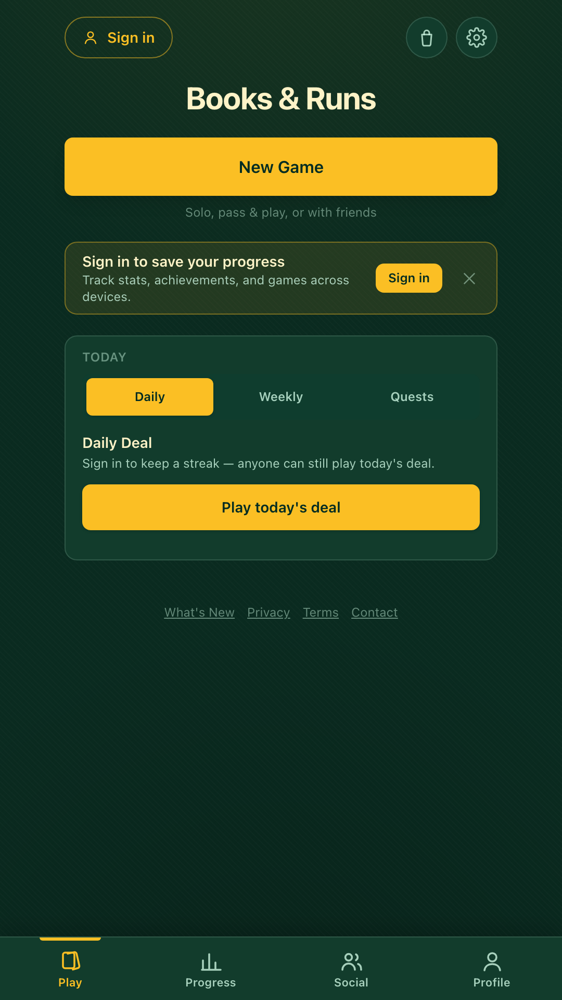
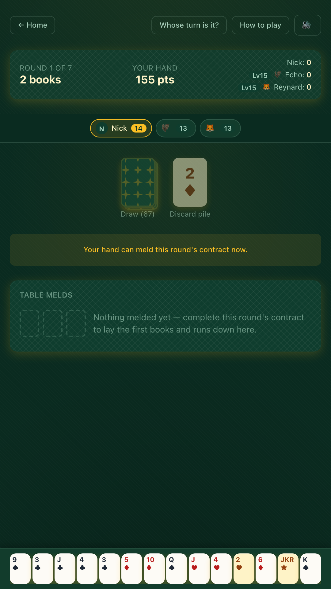

<div align="center">

# Books & Runs

**A free Contract Rummy card game — solo against AI, pass-and-play on one device, or turn-based online with friends.**

[](https://github.com/nickldimartino/books-and-runs/actions/workflows/ci.yml)


**[Play it now → books-and-runs.vercel.app](https://books-and-runs.vercel.app)**

&nbsp;&nbsp;&nbsp;

</div>

---

## Contents

- [About](#about)
- [Features](#features)
- [How the game works](#how-the-game-works)
- [Tech stack](#tech-stack)
- [Architecture](#architecture)
- [Getting started](#getting-started)
- [Scripts](#scripts)
- [Backend setup (optional)](#backend-setup-optional)
- [Testing and CI](#testing-and-ci)
- [Deployment](#deployment)
- [iOS app](#ios-app)
- [Contributing](#contributing)
- [Documentation](#documentation)
- [License](#license)

## About

Books & Runs is an installable web app (PWA) for **Contract Rummy**: seven rounds,
each with a different contract of books and runs you must lay down before you
can go out, and the lowest total score wins. It runs entirely in the browser
for solo and pass-and-play games — no account, no download — and adds accounts,
cloud sync, and asynchronous online multiplayer when you sign in.

The rules live in a framework-free TypeScript engine that is shared by the
browser UI and the server, so a multiplayer move is validated by the exact same
code the game uses locally.

## Features

**Ways to play**

- **Solo and pass-and-play** — one or more humans on a single device against
  AI opponents, with a "pass the device" gate between turns
- **Five AI tiers** — Beginner to Expert, each with named personalities and
  a human-style lapse rate that shrinks as the tier rises
- **Async multiplayer** — invite friends (and fill seats with AI), take turns
  on your own schedule, get push notifications when it's your move
- **Daily Deal and Weekly Challenge** — the same seeded shuffle for everyone,
  with streaks (and a streak shield) when signed in
- **Interactive tutorial**, an in-person **scorekeeper** for physical card
  games, and flexible round modes (all 7, short, custom, marathon)

**Progression and social**

- Account levels and XP, 200+ achievements, rotating daily/weekly quests
- Leaderboards, a skill rating for multiplayer, friends, clubs, round-robin
  tournaments, matchmaking, and a cosmetics Boutique (with gifting)
- Server-verified stats: multiplayer is refereed by the server, and finished
  solo games are replayed server-side before they count

**Polish and accessibility**

- 10 languages: English, 中文, 日本語, 한국어, Deutsch, Français, Español,
  Português (BR), Русский, Italiano
- Dozens of themes, card faces and card backs; colorblind modes, adjustable
  text size, reduced motion, high-contrast / forced-colors support, full
  keyboard and gamepad control, and screen-reader announcements for game flow
- Installable and offline-capable, with an in-app prompt when a new version
  is available
- Optional 2FA, data export, and account deletion

## How the game works

Each player is dealt **13 cards** from a shared deck (one 52-card deck per two
players, plus jokers). On your turn you **draw**, optionally **meld** your
contract, **lay off** cards onto melds already on the table, and **discard**.
The first player out ends the round; everyone else scores penalty points for
what's left in their hand. **Lowest total after the final round wins.**

| Round | Contract |
|:-:|---|
| 1 | 2 books |
| 2 | 1 book + 1 run |
| 3 | 2 runs |
| 4 | 2 books + 1 run |
| 5 | 1 book + 2 runs |
| 6 | 3 books |
| 7 | 3 runs — the whole hand must go down at once, no discard |

- A **book** is 3+ cards of the same rank; a **run** is 4+ consecutive cards of
  one suit (Ace is low or high, never wrapping).
- **Jokers are wild; 2s are dual-purpose** (wild, or their natural rank). A
  meld can't have more wilds than natural cards, and a run can't have two
  wilds in a row.
- **Penalties:** Joker 50, wild 2 20, Ace 15, face cards and 10s 10, all others 5.

The in-app **How to Play** page has the full rules with examples.

## Tech stack

| Layer | Technology |
|---|---|
| Game engine | Pure TypeScript (`src/`) — no React, DOM, or network |
| Web app | Next.js 16 (static export), React 19, Tailwind CSS 4 |
| Backend | Supabase — Postgres with row-level security, Auth, Edge Functions (Deno) |
| Payments | Stripe Payment Links (optional one-time tip) |
| Native shell | Capacitor 8 (iOS) |
| Testing | Vitest, Testing Library, Playwright, axe-core |
| Hosting / CI | Vercel, GitHub Actions |

> **Heads-up:** this repo runs a modified Next.js whose APIs and conventions
> differ from upstream. Read [`AGENTS.md`](AGENTS.md) and
> `node_modules/next/dist/docs/` before changing routing, config, or rendering.

## Architecture

```
src/        Pure game engine. Rules, AI, scoring, achievements, multiplayer
  │         adapter. Imports nothing from app/ or supabase/. Fully unit-tested.
  │
app/        Next.js static-export app. Renders the engine, owns all UI,
  │         talks to Supabase for accounts, stats, and multiplayer.
  │
supabase/   Postgres migrations (applied by hand) and Edge Functions.
            The `mp` function runs src/ server-side so multiplayer state is
            sealed — clients only ever see their own redacted view.
```

The golden rule is that **`src/` never imports from `app/` or `supabase/`**.
The engine is consumed directly by the app and, via a build-time bundle, by the
Edge Functions.

```
src/            game engine (rules, AI tiers, scoring, achievements, mp/)
app/            routes, components, contexts, stores, i18n (app/lib/i18n)
supabase/
  migrations/   numbered .sql files, run in order
  functions/    mp, solo-verify, contact, create-checkout-session,
                stripe-webhook, daily-deal-reminder, delete-account
e2e/            Playwright specs (functional, accessibility, visual, multiplayer)
sw/, public/    service-worker template, PWA assets, init script
scripts/        bundling, release-note check, bundle-size check, load test
ios/            Capacitor Xcode project
docs/           audit reports
```

A file-by-file tour lives in [`CODEBASE_MAP.md`](CODEBASE_MAP.md).

## Getting started

**Prerequisites:** Node.js 22+ and npm. No Supabase project or other services
are needed to play locally — solo, pass-and-play, the Daily Deal, and the
tutorial all work out of the box.

```bash
git clone https://github.com/nickldimartino/books-and-runs.git
cd books-and-runs
npm install
npm run dev        # http://localhost:3000
```

To enable accounts, stats, and multiplayer locally, copy the example env file
and fill in your Supabase project's values (see
[Backend setup](#backend-setup-optional)):

```bash
cp .env.local.example .env.local
```

| Variable | Purpose |
|---|---|
| `NEXT_PUBLIC_SUPABASE_URL` | Your Supabase project URL |
| `NEXT_PUBLIC_SUPABASE_ANON_KEY` | Public anon key (safe client-side; access is enforced by row-level security) |
| `NEXT_PUBLIC_VAPID_PUBLIC_KEY` | *Optional.* Public half of the Web Push keypair for "your turn" notifications |

Without the Supabase variables the app degrades gracefully — Sign in and
multiplayer show a friendly "not set up" message instead of failing.

## Scripts

| Command | What it does |
|---|---|
| `npm run dev` | Start the Next.js dev server |
| `npm run build` | Production build (static export to `out/`) |
| `npm test` | Vitest — engine (Node) and app (jsdom) unit/component tests |
| `npm run test:e2e` | Playwright end-to-end tests |
| `npm run test:e2e:ci` | The CI e2e set (excludes `@visual` screenshots) |
| `npm run test:e2e:visual` | Visual-regression tests |
| `npm run i18n:check` | Translation parity and hardcoded-text guards |
| `npm run lint` | ESLint |
| `npx tsc --noEmit` | Type-check |
| `npm run demo` | Headless demo: AIs play a full game in the terminal |
| `npm run ios:sync` / `ios:open` | Build and sync / open the iOS project |

## Backend setup (optional)

Everything above works without a backend. To turn on accounts, cloud sync,
and multiplayer:

1. **Create a project** at [supabase.com](https://supabase.com) and enable the
   Email auth provider.
2. **Apply the migrations** in `supabase/migrations/` in numeric order by
   pasting each file into the Supabase SQL editor. They're written to be safe to
   re-run; see [`supabase/migrations/README.md`](supabase/migrations/README.md).
3. **Add redirect URLs** under *Authentication → URL Configuration*:
   `<your-site>/reset-password` and `http://localhost:3000/reset-password`.
4. **Deploy the Edge Functions** (multiplayer needs `mp`):

   ```bash
   node scripts/bundle-mp-engine.mjs
   npx supabase functions deploy mp
   ```

   Re-run the bundle step whenever anything in `src/` changes. Each function's
   purpose, secrets, and smoke test are documented in
   [`supabase/functions/README.md`](supabase/functions/README.md).
5. **Set a custom SMTP provider** for real use — Supabase's built-in email is
   rate-limited and not meant for production.

## Testing and CI

- **Unit and component tests** (Vitest, 1,400+) cover the rules engine, AI,
  multiplayer adapter, achievements, scoring, stores, and React components.
  A randomized fuzz test plays full games to guard against stuck rounds.
- **End-to-end tests** (Playwright) run across five browser projects —
  desktop Chromium, mobile Chrome, WebKit, mobile Safari, and Firefox — and
  include axe-core accessibility sweeps in light and dark themes, plus a
  pseudo-locale check that fails on any untranslated UI text.
- **Visual regression** compares screenshots against baselines generated in a
  pinned Playwright Docker image, so they're byte-reproducible in CI.

GitHub Actions runs three jobs on every push to `main` and every pull request:

| Job | Runs |
|---|---|
| `check` | type-check, lint, i18n guards, unit tests, production build, initial-bundle guard, release-note check |
| `e2e` | Playwright functional and accessibility specs across all browser projects |
| `e2e-visual` | Pixel-diff regression of key screens |

## Deployment

The web app is a fully static export. Pushing to `main` deploys it to Vercel
at [books-and-runs.vercel.app](https://books-and-runs.vercel.app); response
headers and the Content-Security-Policy are set in [`vercel.json`](vercel.json).
Database migrations and Edge Functions are deployed separately, as described
in [Backend setup](#backend-setup-optional).

## iOS app

The static export is wrapped for iOS with Capacitor. It builds and runs in the
Simulator; it is not currently distributed on the App Store.

```bash
npm run ios:sync   # rebuild the web app and sync ios/
npm run ios:open   # open in Xcode, pick a Simulator, Run
```

Running on a real device requires signing with your own Apple ID and changing
the bundle ID (`com.booksandruns.app`) in `capacitor.config.json` and
`ios/App/App/Info.plist`.

## Contributing

Issues and pull requests are welcome. Before opening a PR:

- Run `npx tsc --noEmit`, `npm run lint`, `npm test`, and `npm run build` —
  the same checks CI runs.
- **Never hardcode user-facing text.** Everything a player can see or hear goes
  through `t()` / `tPlural()` and must exist in all 10 locale files in
  `app/lib/i18n/dictionaries/`. `npm run i18n:check` enforces this; the full
  checklist is in [`AGENTS.md`](AGENTS.md).
- **Add a release note** to `app/lib/releases.ts` for any player-facing change.
  CI fails otherwise; a change with nothing user-visible can opt out with a
  `Release-note: none` line in the commit message.
- Keep the layering: `src/` must stay free of React, DOM, and Supabase imports.

## Documentation

| Document | Contents |
|---|---|
| [`CODEBASE_MAP.md`](CODEBASE_MAP.md) | Whole-project navigation guide: layers, routes, data flows, backend, conventions |
| [`AGENTS.md`](AGENTS.md) | Conventions for working in this repo, including the i18n checklist |
| [`supabase/migrations/README.md`](supabase/migrations/README.md) | How migrations are applied and verified |
| [`supabase/functions/README.md`](supabase/functions/README.md) | Edge Function deploy, secrets, and smoke tests |
| [`docs/audits/`](docs/audits) | UX, retention, accessibility, and i18n audit reports |
| [What's New](https://books-and-runs.vercel.app/releases) | Release history |

## License

No license file is currently included, so all rights are reserved by default.
Please open an issue if you'd like to use or build on this project.
